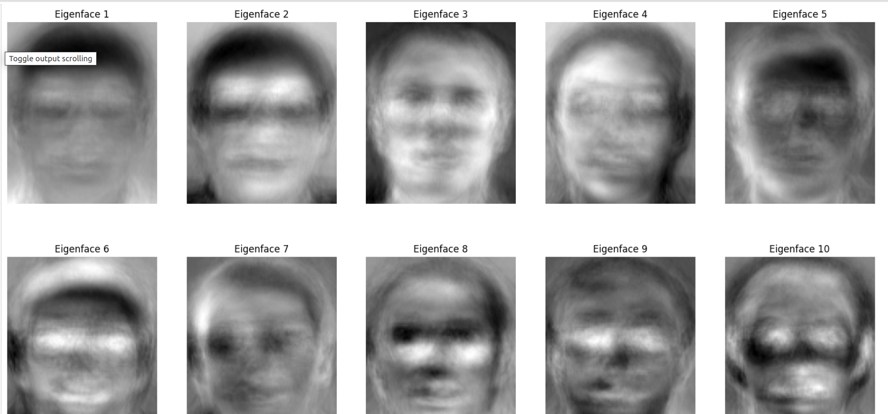
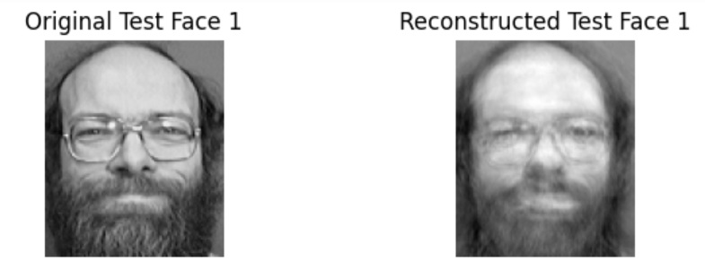
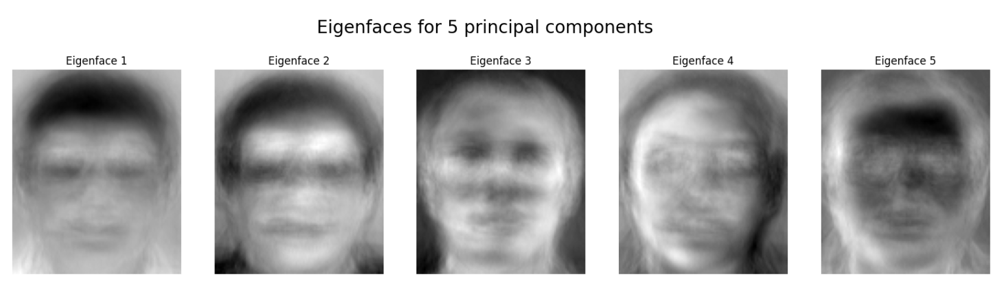
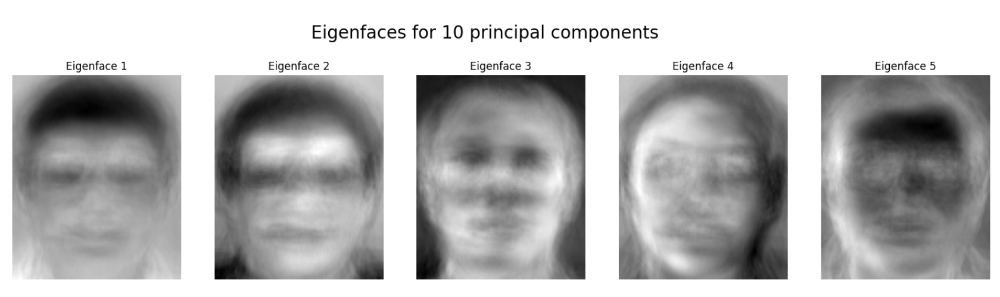
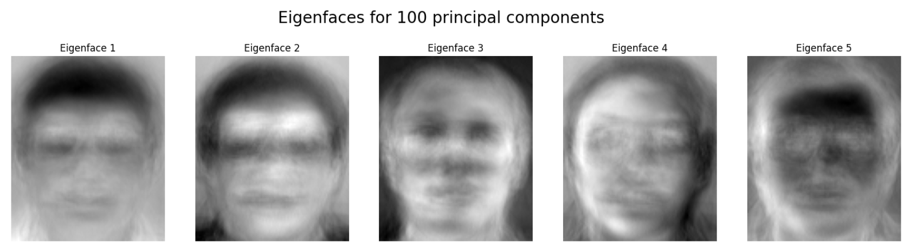
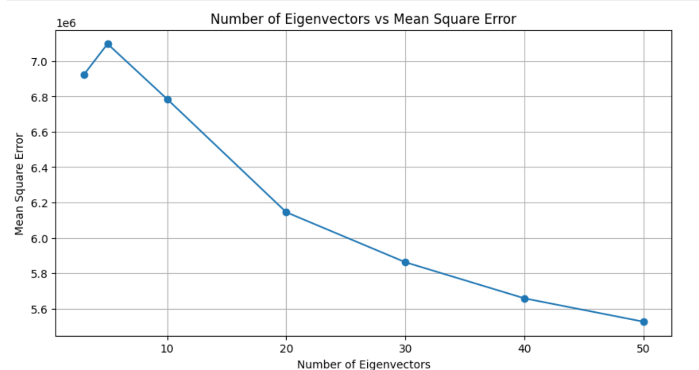

# Face Recognition Using Principal Component Analysis (PCA)

This project implements a basic face recognition system using Principal Component Analysis (PCA). The goal is to recognize a person's face by projecting images onto a feature space (called "face space") defined by eigenfaces, which are the eigenvectors of the set of face images.

## Dataset

We use the AT&T face dataset, a collection of grayscale face images with dimensions 92x112. The dataset is organized into 40 subjects, each with 10 images taken under varying lighting, facial expressions, and details (such as glasses). The dataset is available [here](https://git-disl.github.io/GTDLBench/datasets/att_face_dataset/).

## Key Tasks

### 1. Load Dataset:

- Images are read from subdirectories, labeled, and split into training and test sets.

### 2. Implement PCA:

- PCA is implemented from scratch to extract eigenfaces from the dataset.
- The eigenfaces represent the most significant features that vary across the faces.

### 3. Image Reconstruction:

- Test images are reconstructed using a varying number of principal components.
- Visualization of reconstructed images alongside the original test images.

### 4. Visualize Eigenfaces:

- Display eigenfaces (top components) for different numbers of principal components.

### 5. Face Recognition:

- Implement a recognition module that classifies test images based on the norm between the reconstructed image and the training set.
- Evaluate the accuracy of recognition with different numbers of principal components.

### 6. Error Analysis:

- Plot the Mean Squared Error (MSE) as a function of the number of eigenfaces used.
- Logarithmic error analysis for further insights.

## Results

The recognition accuracy and MSE vary with the number of eigenfaces used. A detailed analysis is provided, showing how accuracy improves as more components are added but plateaus after a certain point.

## Visualizations

- Eigenfaces are visualized to demonstrate how the PCA components capture different variations in the dataset.
- Reconstructed images for test faces are compared with the original test images.

## Installation and Usage

1. Install dependencies:

```
pip install numpy matplotlib opencv-python tqdm
```

2. Download the AT&T face dataset and place it in the root directory: [AT&T Face Dataset](https://git-disl.github.io/GTDLBench/datasets/att_face_dataset/)

3. Run the Jupyter notebook or Python script to see the face recognition system in action.

### Eigenfaces:



### Sample of original image and reconstructed image.



### Eigenfaces for 5 principal components:



### Eigenfaces for 10 principal components:



### Eigenfaces for 50 principal components:


### Eigenfaces for 100 principal components:



### Number of eigen vectors vs mean squarred error plot



### Number of eigen vectors vs logarithmic mean squarred error plot